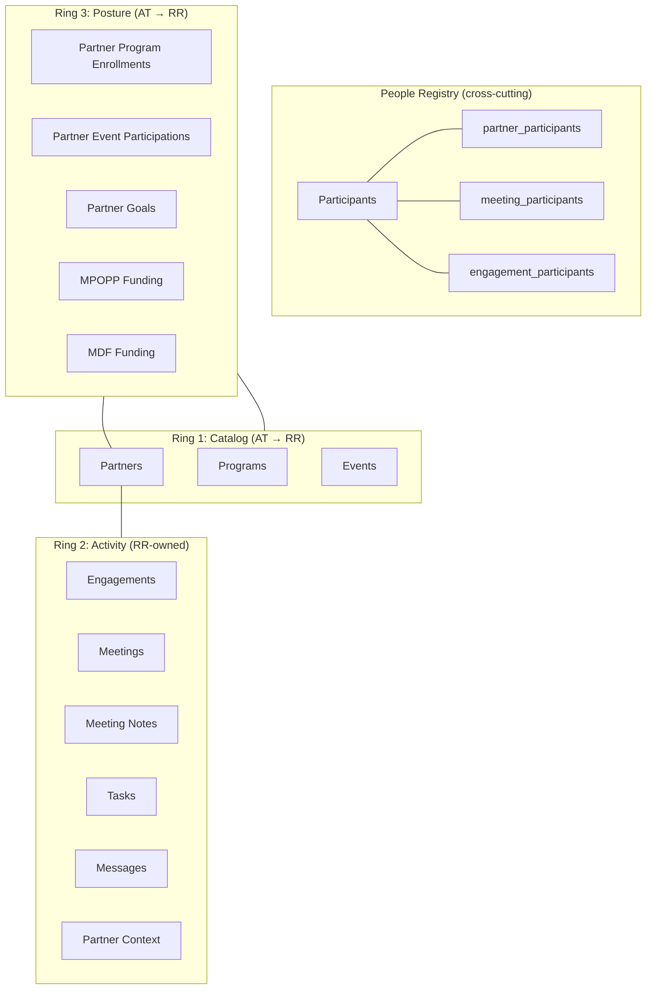
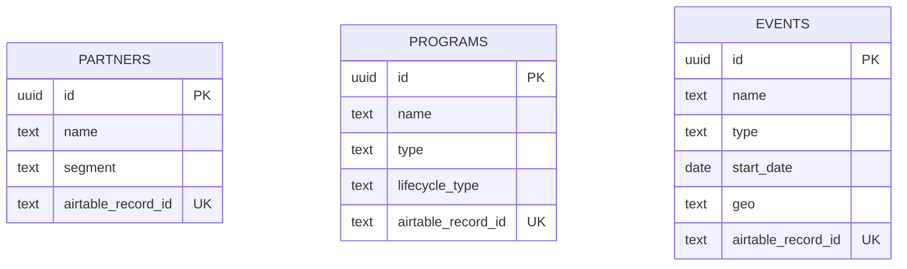
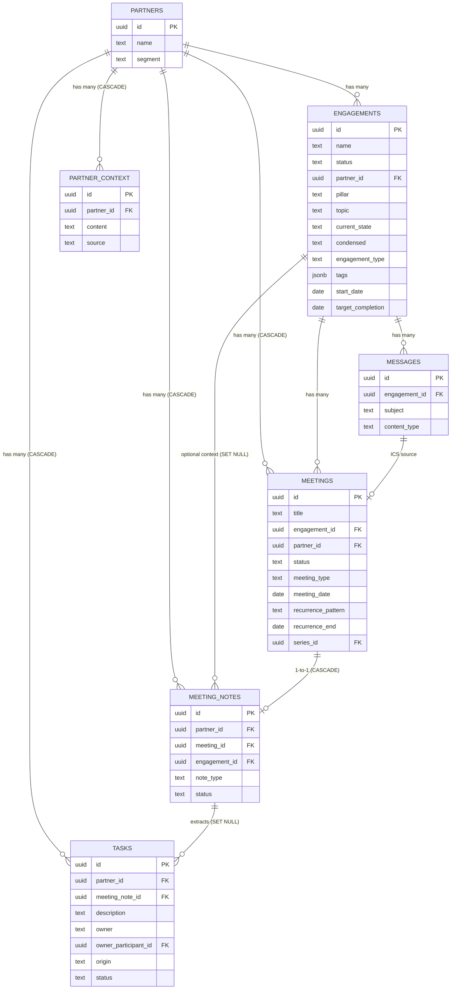
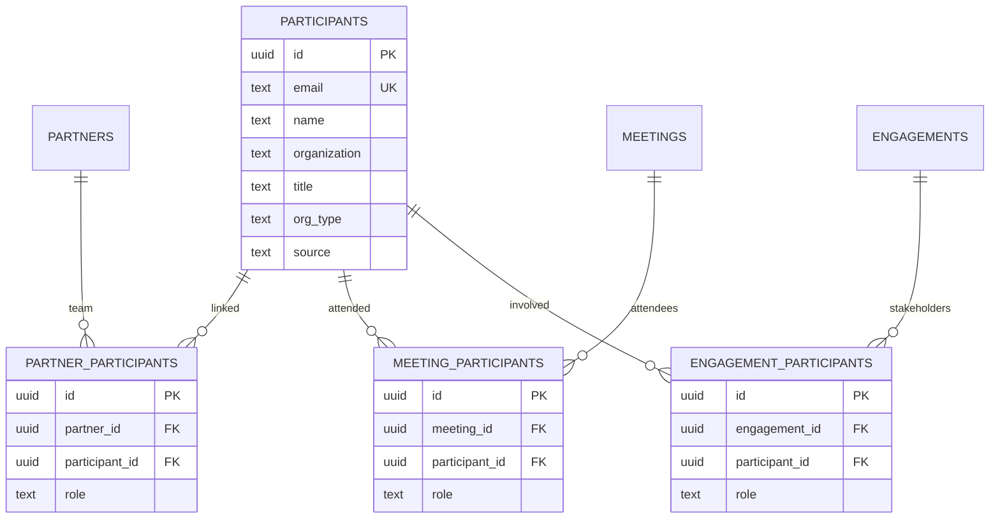
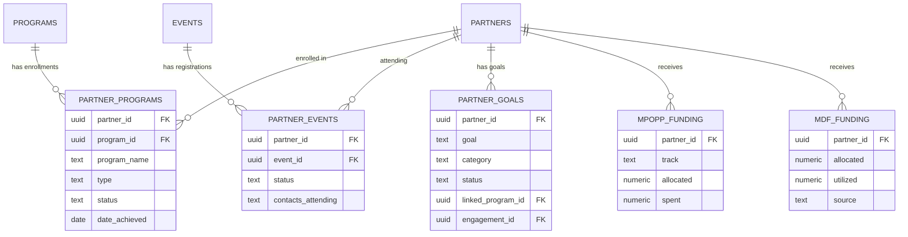

# Roadrunner Entity Model

> **Last updated**: 2026-03-29 (dissolved engagement junctions + relationships, program_name column, CI email index)
> 17 active tables · 82 migrations · Ring 3 pull sync operational

---

## System Ownership Legend

| Badge | Meaning |
|-------|---------|
| **AT** | Airtable-owned — source of truth lives in Airtable, pulled into Supabase |
| **RR** | Roadrunner-owned — source of truth lives in Supabase, pushed to Airtable |
| **RR-only** | Roadrunner-only — no Airtable representation |
| **AT-only** | Airtable-only — not yet in Supabase (planned for future sync) |
| **LEGACY** | Replaced and dropped — historical reference only |

---

## Ring Overview

---

## Ring 1: Catalog (Airtable → Roadrunner)

Reference data that changes slowly. AT-owned, pulled into Supabase via Sync Catalogs. The nouns everything else references.

---

### PARTNERS (Synced — AT-owned catalog, pulled into RR)

**Airtable Table:** `tbl9zC6nxfLEp8xUx` · **Sync constant:** `PTRF`

| Field | SB Type | AT Type | Owner | Sync | AT Field ID | UI |
|-------|---------|---------|-------|------|-------------|-----|
| id | uuid PK | — | RR | — | — | all partner pages |
| name | text NOT NULL | multilineText | AT | ← AT | fldlE5L12oES6IQSO | partner list, detail, sidebar |
| segment | text | singleSelect (6 options) | AT | ← AT | fldSoIAhWfmPgHzuc | partner list, detail |
| focus_area | text[] | multipleSelects (25 options) | AT | ← AT | fldeW5BvDgSp1bLNX | partner detail |
| spms_id | integer UNIQUE | number | AT | ← AT | fld9gzD2CRM9NApUH | — |
| what_they_do | text | multilineText | AT | ← AT | fldnoDB2la8oLgrqR | partner detail, notes context |
| aws_stickiness | text | multilineText | AT | ← AT | fldlCzNjHA3Ziuqtv | notes context |
| key_aws_services | text[] NOT NULL | multipleSelects (29 options) | AT | ← AT | fldQwm8UtaNxAa9dI | partner detail, notes context |
| architecture | text | singleSelect (3 options) | AT | ← AT | fldjzkMqOVIaProi2 | partner detail, notes context |
| listing_types | text[] | multipleSelects (5 options) | AT | ← AT | fldV5OAuGxca1hDW8 | partner detail, notes context |
| pricing_model | text[] | multipleSelects (6 options) | AT | ← AT | fldkStAdCBT16HJPS | partner detail, notes context |
| isva_status | text | singleSelect (2 options) | AT | ← AT | fldHYucRg9ZIJ6PWI | partner detail |
| deployed_on_aws | text | singleSelect (4 options) | AT | ← AT | fldNtBO1Wlh9mOL0c | partner detail |
| prm_status | text | singleSelect (3 options) | AT | ← AT | fldDV1UhZjAuR1Xxl | partner detail |
| crm_platform | text CHECK (Salesforce, HubSpot, Other, None) | singleSelect | AT | ← AT | fldPdisuSJruZqLbo | partner detail (status tab) |
| crm_notes | text | multilineText | AT | ← AT | fldCrmNotesXXX | partner detail (status tab) |
| joint_value_proposition | text | multilineText | AT | ← AT | fldJvpXXX | partner detail (profile tab) |
| mp_tcv_goal | numeric | number | AT | ← AT | fldJwFIRzYit9MsQe | partner detail (Co-Sell Performance) |
| larr_goal | numeric | number | AT | ← AT | fldAS4Qa8F39qc7La | partner detail (Co-Sell Performance) |
| mp_tcv_ytd | numeric | number | AT | ← AT | fldPjzGNolAHbLrlE | partner detail (Co-Sell Performance) |
| larr_ytd | numeric | number | AT | ← AT | fld9I88K1ijili8Af | partner detail (Co-Sell Performance) |
| mp_tcv_2024 | numeric | number | AT | ← AT | fld6BOKL7CmXdmR2D | partner detail (Co-Sell Performance) |
| larr_2024 | numeric | number | AT | ← AT | fldjI3nMg5ich9DKL | partner detail (Co-Sell Performance) |
| mp_tcv_2025 | numeric | number | AT | ← AT | fldM1iuzmDdLT3axX | partner detail (Co-Sell Performance) |
| larr_2025 | numeric | number | AT | ← AT | fld1uD9SHVZvnU5wR | partner detail (Co-Sell Performance) |
| mp_tcv_target_2025 | numeric | number | AT | ← AT | fld5C6rHOzZVu6MXw | partner detail (Co-Sell Performance) |
| mp_tcv_projected_annual | numeric | formula | AT | ← AT | fldQwP5RFGW3fhuAb | partner detail (Co-Sell Performance) |
| larr_projected_annual | numeric | formula | AT | ← AT | fldlw3f03ebKd5Jpf | partner detail (Co-Sell Performance) |
| airtable_record_id | text UNIQUE | — | RR | — | — | — |
| created_at | timestamptz | — | RR | — | — | — |
| updated_at | timestamptz | — | RR | — | — | — |

**AT fields NOT in Supabase (linked records / computed):**

| AT Field | AT Type | AT Field ID | Plan |
|----------|---------|-------------|------|
| MPOPP Funding | linkedRecord → MPOPP Funding | fld1NCw566nVkuRZQ | separate table (partner_funding_mpopp) |
| MDF Funding 2026 | linkedRecord → MDF Funding | fldkU6G8mr0oRvlIE | separate table (partner_funding_mdf) |
| MDF Spent | number | fldxFdsp3DiWrIeXa | computed in AT |
| MDF Total Allocated | rollup | fld5EmiUardg2DBjA | computed in AT |
| MDF Remaining | formula | fldp57wu1hlHVZtJL | computed in AT |
| Co-Sell Goals 2026 | linkedRecord → Co-Sell Goals | fldeeaBJPf3V3aJK3 | dissolved into partner columns (decision #318) |
| Partner Engagements | linkedRecord → Engagements | fldQYMSnTe8Y5HmxL | computed (reverse link) |

---

### PROGRAMS (Synced — AT-owned catalog, pulled into RR)

**Airtable Table:** `tblpnW8ibVmkWi5Dt` · **Sync constant:** `PF`

| Field | SB Type | AT Type | Owner | Sync | AT Field ID | UI |
|-------|---------|---------|-------|------|-------------|-----|
| id | uuid PK | — | RR | — | — | program detail |
| name | text NOT NULL | singleLineText | AT | ← AT | fldlJgX0tVWwA516E | program list, detail, classifier |
| type | text CHECK (8 options) | singleSelect (8 options) | AT | ← AT | fldCd7TnUOgxnWmNt | program list, detail, classifier |
| description | text | multilineText | AT | ← AT | fldHN5mCWH6lXmoY1 | program detail, classifier |
| requirements | text | multilineText | AT | ← AT | fldxxsFFMc649nZft | program detail, classifier |
| what_it_unlocks | text | multilineText | AT | ← AT | fld4870bblJTGbAgn | program detail |
| notes | text | multilineText | AT | ← AT | fldzsmhcQ0Z6Rnjhk | — |
| lifecycle_type | text NOT NULL CHECK (indefinite, recurring, expiring) | singleSelect (3 options) | AT | ← AT | fldo04XmU7rQhwOVT | program detail |
| lifecycle_duration | text | singleLineText | AT | ← AT | fldeExdR8irrzC5GV | program detail |
| airtable_record_id | text UNIQUE | — | RR | — | — | — |
| created_at | timestamptz | — | RR | — | — | — |
| updated_at | timestamptz | — | RR | — | — | — |

**AT fields NOT in Supabase:**

| AT Field | AT Type | AT Field ID | Plan |
|----------|---------|-------------|------|
| Partner Engagements | linkedRecord → Engagements | fldotD0TG22LiWMPF | computed (reverse link) — no action needed |

---

### EVENTS (Synced — AT-owned catalog, pulled into RR)

**Airtable Table:** `tblPDGUSqSvn8mflJ` · **Sync constant:** `EF`

| Field | SB Type | AT Type | Owner | Sync | AT Field ID | UI |
|-------|---------|---------|-------|------|-------------|-----|
| id | uuid PK | — | RR | — | — | event detail |
| name | text NOT NULL | multilineText | AT | ← AT | fld1hURggkL0DTHnC | event list, detail, classifier |
| type | text NOT NULL CHECK (8 options) | singleSelect (8 options) | AT | ← AT | fldpuxeQ5DRhMwizr | event list, detail |
| start_date | date | date (Event Date) | AT | ← AT | fld62hHfwpOJw7nyZ | event list, detail, classifier |
| end_date | date | date | AT | ← AT | fldTUy6jHj4KpR6SZ | event detail |
| location | text | multilineText | AT | ← AT | fldwjmRq0saFpFHao | event detail |
| host | text | singleLineText | AT | ← AT | fldaDlidcRmUCvxFK | event detail |
| description | text | multilineText | AT | ← AT | fldTMiRJ7mqMzGqXY | event detail, classifier |
| geo | text CHECK (NAMER, EMEA, APJ, LATAM, GCR) | singleSelect (5 options) | AT | ← AT | fld9idvQawFVNu5sa | event list, detail |
| sponsor_option | boolean | checkbox | AT | ← AT | fldyAVpfZbG1SaDJz | event detail |
| partner_day | boolean | checkbox | AT | ← AT | fldTWZbQSEruQYdLe | event detail |
| partner_day_date | date | date | AT | ← AT | fldo8mDJ5vvXK5bu7 | event detail |
| source | text NOT NULL CHECK (seed, email_extracted, user_created) | — | RR | — | — | — |
| verified | boolean | — | RR | — | — | — |
| airtable_record_id | text UNIQUE | — | RR | — | — | — |
| created_at | timestamptz | — | RR | — | — | — |
| updated_at | timestamptz | — | RR | — | — | — |

**AT fields NOT in Supabase:**

| AT Field | AT Type | AT Field ID | Plan |
|----------|---------|-------------|------|
| Partner Event Status | linkedRecord → Partner Events | fldzZHhJL93Z3U7yd | sync later (with Partner Events table) |
| Partner Engagements | linkedRecord → Engagements | fldJkZBe4oR3oezUH | computed (reverse link) — no action needed |

---

## Ring 2: Activity (Roadrunner-owned)

The PDM's daily work. Fast-changing, RR-owned, pushed to Airtable. Engagement is the hub that organizes work streams; meetings are temporal events; notes and tasks are the outputs.

---

### ENGAGEMENTS (Synced — RR-owned activity, pushed to AT)

**Airtable Table:** `tblTC491AUVcrKvq2` · **Sync constant:** `ENF`

| Field | SB Type | AT Type | Owner | Sync | AT Field ID | UI |
|-------|---------|---------|-------|------|-------------|-----|
| id | uuid PK | — | RR | → AT (as Roadrunner ID) | fldJJ8ZlwhePawiEl | engagement detail |
| name | text NOT NULL | singleLineText | RR | → AT | fldxq7bsx8PuRvodp | engagement list, detail, inbox |
| status | text NOT NULL CHECK (planned, active, blocked, completed, archived) | singleSelect (5 options) | RR | → AT | fldUAOu4GG1Wme5OJ | engagement list, detail |
| partner_id | uuid FK → partners | linkedRecord → Partners | RR | → AT (resolved to AT record) | fldkYNE9C0UcdnGCL | engagement list, detail |
| pillar | text CHECK (Co-Sell, Co-Market, Co-Build) | singleSelect (3 options) | RR | → AT | fldvxfxhOPDGr5jBA | engagement list, detail |
| topic | text | singleLineText | RR | → AT | fldDRMrtkVHOdDYVy | engagement detail |
| current_state | text | multilineText (merged into Notes) | RR | → AT | flduVQ9wp3XXVUiwo | engagement detail |
| condensed | text | — | RR | — | — | brain context (upstream AI) |
| engagement_type | text | — | RR | — | — | — (taxonomy TBD) |
| tags | jsonb | — | RR | — | — | — |
| start_date | date | — | RR | — | — | engagement detail |
| target_completion | date | — | RR | — | — | engagement detail |
| program_id | uuid FK → programs | linkedRecord → Programs | RR | → AT (resolved to AT record) | fldZ4IqdSvuEXgp83 | engagement detail |
| closed_at | timestamptz | — | RR | — | — | — |
| airtable_record_id | text UNIQUE | — | RR | — | — | — |
| created_at | timestamptz | — | RR | — | — | — |
| updated_at | timestamptz | — | RR | — | — | — |

**AT fields computed from RR data (not stored in Supabase):**

| AT Field | AT Type | AT Field ID | Source |
|----------|---------|-------------|--------|
| AWS Stakeholders | multilineText | fldLVPbg7iyz0Nli9 | computed from engagement_participants (role=aws) |
| Partner Stakeholders | multilineText | fldj6vaWwDKJy6aci | computed from engagement_participants (role=partner) |
| Third Parties | multilineText | flduajBotnT6x5ZXD | computed from engagement_participants (role=third_party) |
| Meetings | linkedRecord → Meetings | fldqM0QO5VWjhmvw3 | computed (reverse link from Meetings.Engagement) |

---

### MEETINGS (Synced — RR-owned activity, pushed to AT)

**Airtable Table:** `tbl6LsEqSvEZgqBdW` · **Sync constant:** `MF`

*`partner_id` FK behavior changed to CASCADE in migration 060.*

| Field | SB Type | AT Type | Owner | Sync | AT Field ID | UI |
|-------|---------|---------|-------|------|-------------|-----|
| id | uuid PK | — | RR | → AT (as Roadrunner ID) | fldLveS95zGGVU4j1 | meeting detail |
| title | text NOT NULL | singleLineText | RR | → AT | fldcbatIDunJ00dLp | meeting list, detail, timeline |
| engagement_id | uuid FK → engagements (SET NULL) | linkedRecord → Engagements | RR | → AT | fld2TczwxJXZLUwpW | meeting detail |
| partner_id | uuid FK → partners (CASCADE) | — (lookup through engagement) | RR | — | — | meeting list, detail |
| message_id | uuid FK → messages (SET NULL) | — | RR | — | — | — |
| status | text NOT NULL CHECK (scheduled, completed, cancelled, did_not_occur) | singleSelect (4 options) | RR | → AT | fldpXlLugkUgQsjcr | meeting list, detail |
| meeting_type | text CHECK (10 options: partner_cadence, sca_review, qbr, executive, event, internal, support, demo, enablement, ad_hoc) | singleSelect (10 options) | ↔ | → AT | fldGWa1MFoqoc89qC | meeting detail |
| meeting_date | date | date | RR | → AT | fldx9ZrIMundEMUko | meeting list, detail, timeline |
| start_time | text | singleLineText | RR | → AT | fldifWilEYICfifXz | meeting detail |
| end_time | text | singleLineText | RR | → AT | fldV78rQbzDhVK9NO | meeting detail |
| location | text | singleLineText | RR | → AT | fldTyiMYT48aCHttx | meeting detail |
| organizer_email | text | — | RR | — (internal) | — | — |
| organizer_name | text | — | RR | — (internal) | — | — |
| ics_uid | text UNIQUE | singleLineText | RR | → AT | fldNb83l5XLtz8J9k | — |
| sequence | integer | — | RR | — (internal) | — | — |
| is_recurring | boolean | — | RR | — (DEPRECATED: use recurrence_pattern) | — | — |
| source | text CHECK (manual, ics_parsed, body_parsed, auto) | singleSelect | RR | → AT | fld2RW78vS1T91bab | — |
| recurrence_pattern | text | — | RR | — | — | meeting detail (RecurrenceEditor) |
| recurrence_end | date | — | RR | — | — | meeting detail (RecurrenceEditor) |
| series_id | uuid FK → meetings (self-ref, SET NULL) | — | RR | — | — | meeting detail (series nav) |
| anchor_day | smallint | — | RR | — | — | meeting detail (series display, recurrence snap) |
| notes | text | multilineText | RR | → AT | fldzGUipu36EA9rax | meeting detail |
| airtable_record_id | text UNIQUE | — | RR | — | — | — |
| created_at | timestamptz | — | RR | — | — | — |
| updated_at | timestamptz | — | RR | — | — | — |

**AT fields computed from RR data:**

| AT Field | AT Type | AT Field ID | Source |
|----------|---------|-------------|--------|
| AWS Stakeholders | multilineText | fldOVCmwhiisY8bDo | computed from meeting_participants registry |
| Partner Stakeholders | multilineText | fldJira79g9xWNTte | computed from meeting_participants registry |
| Third Parties | multilineText | fldhU8nE7uGE1agML | computed from meeting_participants registry |
| Event (from Engagement) | lookup | fldAP7a1eRiunKFta | AT lookup through Engagement link |
| Program (from Engagement) | lookup | fldVsQxvytcpw0XmB | AT lookup through Engagement link |
| Partner (from Engagement) | lookup | fldnhuK2el6fsBjVd | AT lookup through Engagement link |

### Attendee Bucketing Logic (used for AT stakeholder fields)

Both Engagements and Meetings push three computed text fields (AWS Stakeholders, Partner Stakeholders, Third Parties) to Airtable. The bucketing logic in `push.ts`:

**Excluded addresses** (filtered before bucketing):
- `*@relay.stevenromero.dev` — Roadrunner forwarding address
- `*salesforce*` — Salesforce system emails
- Any email matching `isUserEmail()` from `user-config.ts` (corpmail, PRVS, personal aliases)

**Bucket rules** (applied to remaining attendees):
- `@amazon.com` or org contains "AWS"/"Amazon" → **AWS Stakeholders**
- Org matches the engagement/meeting partner name → **Partner Stakeholders**
- Everyone else → **Third Parties**

Output format: one `Name <email> (Title)` per line (universal contact format).

---

### MEETING_NOTES (Roadrunner-only)

*FK cascade behaviors corrected in migration 060: `meeting_id` CASCADE, `partner_id` CASCADE, `engagement_id` SET NULL. `meeting_id` is now actively populated (Decision #148).*

| Field | SB Type | Owner | UI |
|-------|---------|-------|-----|
| id | uuid PK | RR | meeting detail (inline NoteWorkspace) |
| partner_id | uuid NOT NULL FK → partners (CASCADE) | RR | notes list, detail |
| meeting_id | uuid FK → meetings (CASCADE) | RR | notes detail |
| engagement_id | uuid FK → engagements (SET NULL) | RR | notes detail |
| note_type | text NOT NULL CHECK (meeting, seed) | RR | notes list |
| title | text | RR | notes list, detail |
| meeting_date | date | RR | notes list, detail |
| date_range_start | date | RR | notes detail (seed type) |
| date_range_end | date | RR | notes detail (seed type) |
| raw_notes | text NOT NULL | RR | notes detail (collapsible) |
| ai_summary | text | RR | notes detail |
| condensed | text | RR | brain context (upstream AI — 3-5 bullet digest) |
| ai_tasks | jsonb | RR | — (superseded by tasks table) |
| context_snapshot | jsonb | RR | — (audit trail) |
| status | text NOT NULL CHECK (draft, complete) | RR | notes list, detail |
| created_at | timestamptz | RR | — |
| updated_at | timestamptz | RR | — |

---

### TASKS (Roadrunner-only)

*Renamed from `note_tasks` in migration 059. Promoted to partner-level entity. `owner_participant_id` FK added in migration 059. `engagement_id` FK added in migration 070. (Decisions #170-172, #174-175, #280-281)*

| Field | SB Type | Owner | UI |
|-------|---------|-------|-----|
| id | uuid PK | RR | notes detail, partner detail, /tasks |
| meeting_note_id | uuid FK → meeting_notes (SET NULL) | RR | notes detail |
| partner_id | uuid NOT NULL FK → partners (CASCADE) | RR | partner detail, /tasks |
| engagement_id | uuid FK → engagements (SET NULL) | RR | /tasks (engagement linker) |
| description | text NOT NULL | RR | notes detail, /tasks (inline edit) |
| owner | text NOT NULL CHECK (me, internal, partner, third_party) | RR | notes detail |
| owner_name | text | RR | notes detail |
| owner_participant_id | uuid FK → participants (SET NULL) | RR | — |
| status | text NOT NULL CHECK (open, done, cancelled) | RR | /tasks (checkbox) |
| due_date | date | RR | notes detail |
| origin | text NOT NULL CHECK (ai_extracted, manual) | RR | notes detail |
| created_at | timestamptz | RR | — |
| updated_at | timestamptz | RR | — |

---

### MESSAGES (Roadrunner-only)

| Field | SB Type | Owner | UI |
|-------|---------|-------|-----|
| id | uuid PK | RR | inbox, message detail |
| engagement_id | uuid FK → engagements (SET NULL) | RR | inbox, engagement timeline |
| sender_name | text | RR | inbox card |
| sender_email | text | RR | inbox card |
| sent_at | timestamptz | RR | inbox card |
| subject | text | RR | inbox card, engagement timeline |
| body_text | text | RR | message detail |
| body_raw | text | RR | — (debug) |
| content_type | text CHECK (engagement_email, meeting_invite, mixed, noise) | RR | inbox |
| classification_confidence | double precision | RR | inbox |
| classification_result | jsonb | RR | inbox, debug |
| linked_entities | jsonb | RR | — |
| forwarded_at | timestamptz NOT NULL | RR | inbox |
| pending_review | boolean NOT NULL | RR | inbox |
| forwarder_email | text | RR | inbox |
| forwarder_name | text | RR | inbox |
| forwarder_note | text | RR | inbox |
| to_header | text | RR | — |
| cc_header | text | RR | — |

---

### PARTNER_CONTEXT (Roadrunner-only)

*New table added in migration 056. Scratchpad entries are wired into AI context pipeline as "PARTNER CONTEXT (PDM NOTES)" section. (Decisions #163-165)*

| Field | SB Type | Owner | UI |
|-------|---------|-------|-----|
| id | uuid PK | RR | partner detail (PartnerScratchpad) |
| partner_id | uuid NOT NULL FK → partners (CASCADE) | RR | partner detail |
| content | text NOT NULL | RR | partner detail |
| source | text NOT NULL CHECK (scratchpad, ai_synthesis, seed_dump) | RR | — |
| created_at | timestamptz | RR | — |
| updated_at | timestamptz | RR | — |

Indexes: `idx_partner_context_partner` (partner_id), `idx_partner_context_source` (partner_id, source)

---

## People & Connections (Cross-Cutting)

The participant registry is the single source of truth for every person in the system. 3 dedicated join tables connect people to entities with FK CASCADE enforcement. Programs and events link at the partner level via Ring 3 tables, not at the engagement level.

---

### PARTICIPANTS (Roadrunner-only — canonical person registry)

*`org_type`, `source`, and `updated_at` added in migration 057 (Decision #176).*

| Field | SB Type | Owner | UI |
|-------|---------|-------|-----|
| id | uuid PK | RR | — |
| email | text | RR | case-insensitive unique index: `UNIQUE (lower(email))` (migration 080) |
| name | text | RR | — |
| organization | text | RR | — |
| title | text | RR | — |
| org_type | text CHECK (internal, partner, third_party) | RR | — |
| source | text CHECK (airtable_sync, ics_parsed, classifier, manual) | RR | — |
| notes | text | RR | — |
| created_at | timestamptz | RR | — |
| updated_at | timestamptz | RR | — |

All insertion paths normalize email to lowercase before insert (migration 080 + app-level normalization).

---

### PARTNER_PARTICIPANTS (Roadrunner-only — contact registry join)

*New table added in migration 057 (Decision #176).*

| Field | SB Type | Owner | Notes |
|-------|---------|-------|-------|
| id | uuid PK | RR | — |
| partner_id | uuid NOT NULL FK → partners (CASCADE) | RR | — |
| participant_id | uuid NOT NULL FK → participants (CASCADE) | RR | — |
| role | text | RR | Alliance Lead, PSA, AM, PMM, Contact, etc. |
| created_at | timestamptz | RR | — |

UNIQUE constraint: `(partner_id, participant_id, role)`

---

### MEETING_PARTICIPANTS (Roadrunner-only — contact registry join)

*New table added in migration 057 (Decision #176).*

| Field | SB Type | Owner | Notes |
|-------|---------|-------|-------|
| id | uuid PK | RR | — |
| meeting_id | uuid NOT NULL FK → meetings (CASCADE) | RR | — |
| participant_id | uuid NOT NULL FK → participants (CASCADE) | RR | — |
| role | text | RR | — |
| created_at | timestamptz | RR | — |

UNIQUE constraint: `(meeting_id, participant_id)`

---

### ENGAGEMENT_PARTICIPANTS (Roadrunner-only — contact registry join)

*New table added in migration 057 (Decision #176).*

| Field | SB Type | Owner | Notes |
|-------|---------|-------|-------|
| id | uuid PK | RR | — |
| engagement_id | uuid NOT NULL FK → engagements (CASCADE) | RR | — |
| participant_id | uuid NOT NULL FK → participants (CASCADE) | RR | — |
| role | text | RR | — |
| created_at | timestamptz | RR | — |

UNIQUE constraint: `(engagement_id, participant_id)`

---

## Ring 3: Posture (AT → RR Pull Sync)

Where each partner stands — program achievements, event participation, revenue goals, and funding. Pulled from Airtable into Supabase via syncAllCatalogs(). These connect partners to catalog entities (Programs, Events) with per-partner status. Co-Sell Goals 2026 table dissolved into partner columns (decision #318). Partner financial fields (goals + actuals) live on the partners table.

---

### PARTNER_PROGRAM_ENROLLMENTS (AT → RR pull sync)

**Airtable Table:** `tbl1CPtbVzQvRN8LA` · **Supabase Table:** `partner_program_enrollments`

| AT Field | AT Type | AT Field ID | Supabase Column |
|----------|---------|-------------|-----------------|
| Program ID | multilineText | fldmaD6ZTY7XvXkjw | program_name TEXT — primary display label |
| Program | linkedRecord → Programs | flduk1vdlcOFmAnaa | program_id UUID FK SET NULL (optional click-through) |
| Partner | linkedRecord → Partners | fldXXpf6zyDLLAKOz | partner_id UUID FK CASCADE |
| Type | singleSelect (4 options: Competency, Service Ready, Program, Credit Program) | fldu4oNGIHu7h5et5 | type TEXT |
| Status | singleSelect (7 options: Not Started, In Progress, Submitted, Approved, Interested, Denied, Expired) | flddDihdNtRaLgYqn | status TEXT |
| Date Achieved | date | fldJNF6KO3Osq2AWg | date_achieved TEXT |
| AWS Stakeholder | multilineText | fldi0bBVH4VHkjIM3 | aws_stakeholder TEXT |
| Notes | multilineText | fldqpulJjUKcro1xM | notes TEXT |

Additional Supabase columns: airtable_id TEXT UNIQUE (sync dedup key).

`program_name` is always populated from AT "Program ID" text field. `program_id` FK resolves when AT has a linked record to the Programs table (22/80 currently). UI shows program_name as primary label; if program_id is resolved, the name is a clickable link to the program detail page.

---

### PARTNER_EVENT_PARTICIPATIONS (AT → RR pull sync)

**Airtable Table:** `tblYljQDnXwjTDy2T`

| AT Field | AT Type | AT Field ID | Future RR Role |
|----------|---------|-------------|----------------|
| Invitation Record | formula (Event - Partner) | fldvhMnIPETioD6FN | display name |
| Partner | singleLineText | fldFA6221VhsyXG1v | FK → partners |
| Events | linkedRecord → Events | fldIsEwvRqaszKMCh | FK → events |
| Event Date (from Events) | lookup | fld7C5aJOuhcE5rsb | computed |
| Status | singleSelect (4 options: Invited, Registered, Sponsoring, Confirming) | fldWjFeK3yyLo4N5U | status tracking |
| Partner Contacts Attending | multilineText | fldtQthUjkw0028us | contacts |
| Notes | multilineText | fldQHj66TZ81TSaMc | notes |
| Co-Sell Goals 2026 | linkedRecord → Co-Sell Goals | fldBsfehaCJfvME9m | plan linking |

---

### COSELL_GOALS_2026 (ARCHIVED — dissolved into Partners table)

**Airtable Table:** `tbligbfCTvpCkG7tS` (archived, hidden from AT navigation)

| AT Field | AT Type | AT Field ID | Future RR Role |
|----------|---------|-------------|----------------|
| Plan Name | formula (Partner + "2026 Plan") | fld8WW26jMTipRwc2 | display name |
| Plan Status | singleSelect (4: Not Started, In Progress, Submitted, Complete) | fld1hwUnzk1tHLqdJ | status |
| Email Sent with Instructions | singleSelect (Yes/No) | fldr7TFQ8IPDan19z | checklist item |
| Plan Created in Salesforce | singleSelect (Yes/No) | fldeGvhBjNlQeBAcQ | checklist item |
| 2026 MP TCV Goal ($) | number | fldJwFIRzYit9MsQe | target |
| 2026 LARR Goal ($) | number | fldAS4Qa8F39qc7La | target |
| Target Programs | linkedRecord → Partner Programs | fld9UUmULOrgJxdc8 | program goals |
| Target Event Registrations | linkedRecord → Partner Events | fld3hGKaEN7HXpPlx | event goals |
| Misc Goals | multilineText | fldh0gI8cShpNfFhV | freeform goals |
| 2026 MP TCV Target Attainment % | formula | flddScDP9XH3Gb4aX | computed metric |
| 2026 MP TCV YTD ($) | lookup from Partners | fldGyj4UM6YHFDKt3 | computed metric |
| 2026 LARR YTD ($) | lookup from Partners | fld2dmmMrFbd02pJl | computed metric |
| Performance Trend | formula (Strong Growth/On Track/At Risk/Critical) | fldi2JZ8YmwTGln5C | computed status |
| Notes | multilineText | fld9z7ghsIKLeOZ1c | notes |
| Partner Link | linkedRecord → Partners | fldqMc1SjdklIRzFX | FK → partners |
| Months Elapsed 2026 | formula | fldSqwJsKwAAvmA3o | helper |
| Expected Progress % | formula | fldABf0iLPAu3JFZc | computed metric |

---

### PARTNER_GOALS (AT → RR pull sync)

**Airtable Table:** `tblmboZKyBasfh5pV` · **Supabase Table:** `partner_goals`

| AT Field | AT Type | AT Field ID | Supabase Column |
|----------|---------|-------------|-----------------|
| Goal | singleLineText | fldRBFWDIWthlAVcE | goal TEXT NOT NULL |
| Partner | linkedRecord → Partners | fldrxWrawLH3HbpcR | partner_id UUID FK CASCADE |
| Category | singleSelect (7 options) | fld4j48oV32q9iE83 | category TEXT CHECK |
| Year | singleSelect (2026, 2027) | fldTR0rPelRFJ2agz | year INTEGER |
| Target Date | date | fldqwZ8lPVMouy2t3 | target_date DATE |
| Status | singleSelect (4 options) | fldJNIlsAIsiVW8Uv | status TEXT CHECK DEFAULT 'not_started' |
| Program | linkedRecord → Programs | fld0B5PPg49c0m5CI | linked_program_id UUID FK SET NULL |
| Notes | multilineText | fld7kF9CQDxh5uIyM | notes TEXT |

Additional Supabase columns: engagement_id UUID FK SET NULL (decision #325), airtable_id TEXT UNIQUE.

---

### MPOPP_FUNDING (AT → RR pull sync)

**Airtable Table:** `tbl2ilHOaXYsgxqFY`

| AT Field | AT Type | AT Field ID | Future RR Role |
|----------|---------|-------------|----------------|
| Funding Name | formula (Partner + Track) | fldiNSPR6lOc2qn3M | display name |
| Partner | linkedRecord → Partners | fldc3HBSHS2Di8XLd | FK → partners |
| Status | singleSelect (5: Applied, Approved, Rejected, Disbursed, NEEDS ACTION) | fldoNQTpGZMd5Sfkx | status |
| Half | singleSelect (H1, H2) | fld2TO49NsfmAwuZ2 | period |
| Track | singleSelect (Activate, Grow) | fldIbH2P4N7L3abAB | track type |
| Allocated Amount | currency | fldTTVjneQKD2yrX0 | amount |
| Spent Amount | currency | fldll9GvapXWdsYvs | amount |
| Remaining | formula | fldYO4ycGgcnaOGVW | computed |
| Notes | multilineText | fldMo9eIV9KEGRdkE | notes |

---

### MDF_FUNDING (AT → RR pull sync)

**Airtable Table:** `tblRSsochM23QGQpS`

| AT Field | AT Type | AT Field ID | Future RR Role |
|----------|---------|-------------|----------------|
| MDF Record Name | singleLineText | fldz2AadUnmO0Ynoa | display name |
| Partners | linkedRecord → Partners | fld1L71zH44Z4Wrbx | FK → partners |
| Amount Allocated | number | fldISPaiE4oJkekwb | amount |
| Amount Utilized | number | fldaF5qh9pcdDuS9g | amount |
| Date Allocated | date | flddUPAjoPAI3dENU | date |
| Notes | multilineText | fldmypPKmpusuNOwA | notes |
| Source | singleSelect (Competency/Service Ready, Custom) | fld8Itb42n6GqCXRE | source type |
| Recurrence | singleSelect (One-Time, Reloads Next Year) | fldpxpkBoOGoLfcAa | recurrence |

---

## Legacy (Pending Removal)

### PARTICIPANT_LINKS (LEGACY — DROPPED)

**DROPPED** in migration 062. All code rewired to use engagement_participants (Chunks A+B, 2026-03-14). Table no longer exists. Was a polymorphic junction table (`participant_id`, `entity_type`, `entity_id`, `role`) replaced by 4 dedicated join tables (Decisions #169, #180).

| Field | SB Type | Owner | Notes |
|-------|---------|-------|-------|
| id | uuid PK | RR | — |
| participant_id | uuid NOT NULL FK → participants | RR | — |
| entity_type | text NOT NULL CHECK (engagement, event) | RR | — |
| entity_id | uuid NOT NULL | RR | no FK constraint (polymorphic) |
| role | text | RR | e.g., "aws", "partner", "third_party" |
| created_at | timestamptz | RR | — |

UNIQUE index on `(participant_id, entity_type, entity_id)`

---

### ENTITY_LINKS (LEGACY — DROPPED)

**DROPPED** in migration 065 (Decisions #221-222). Was a polymorphic junction table (`source_type`, `source_id`, `target_type`, `target_id`) with no FK constraints. Replaced by typed junction tables which were themselves dissolved in migration 081 — programs and events now link at the partner level via Ring 3 tables.

| Field | SB Type | Owner | Notes |
|-------|---------|-------|-------|
| id | uuid PK | RR | — |
| source_type | text NOT NULL CHECK (engagement, event, program) | RR | — |
| source_id | uuid NOT NULL | RR | no FK constraint (polymorphic) |
| target_type | text NOT NULL CHECK (engagement, event, program) | RR | — |
| target_id | uuid NOT NULL | RR | no FK constraint (polymorphic) |
| relationship | text NOT NULL | RR | dropped — not migrated (Decision #222) |
| context | text | RR | migrated to new tables |
| created_by | text NOT NULL CHECK (ai, user) | RR | migrated to new tables |
| created_at | timestamptz | RR | — |

> **Note:** The `notes` table was dropped in migration 061 (Decision #179). All note functionality flows through `meeting_notes`.

---

## CASCADE Behavior

| Source Table | FK Column | Target Table | On Delete | Rationale |
|---|---|---|---|---|
| engagements | partner_id | partners | SET NULL | Engagement survives partner cleanup |
| engagements | program_id | programs | SET NULL | Engagement survives program cleanup |
| meetings | partner_id | partners | CASCADE | Partner is gravity |
| meetings | engagement_id | engagements | SET NULL | Meeting survives engagement close |
| meetings | message_id | messages | SET NULL | Meeting survives message cleanup |
| meeting_notes | meeting_id | meetings | CASCADE | Notes die with meeting |
| meeting_notes | partner_id | partners | CASCADE | Partner is gravity |
| meeting_notes | engagement_id | engagements | SET NULL | Notes survive engagement close |
| tasks | partner_id | partners | CASCADE | Partner is gravity |
| tasks | engagement_id | engagements | SET NULL | Tasks survive engagement close |
| tasks | meeting_note_id | meeting_notes | SET NULL | Tasks survive note deletion |
| tasks | owner_participant_id | participants | SET NULL | Tasks survive contact cleanup |
| messages | engagement_id | engagements | SET NULL | Messages survive engagement close |
| partner_context | partner_id | partners | CASCADE | Context dies with partner |
| partner_participants | partner_id | partners | CASCADE | Both sides cascade |
| partner_participants | participant_id | participants | CASCADE | Both sides cascade |
| meeting_participants | meeting_id | meetings | CASCADE | Both sides cascade |
| meeting_participants | participant_id | participants | CASCADE | Both sides cascade |
| engagement_participants | engagement_id | engagements | CASCADE | Both sides cascade |
| engagement_participants | participant_id | participants | CASCADE | Both sides cascade |
| partner_goals | partner_id | partners | CASCADE | Partner is gravity |
| partner_goals | linked_program_id | programs | SET NULL | Goal survives program cleanup |
| partner_goals | engagement_id | engagements | SET NULL | Goal survives engagement close |
| partner_program_enrollments | partner_id | partners | CASCADE | Partner is gravity |
| partner_program_enrollments | program_id | programs | CASCADE | Enrollment dies with program |
| partner_event_participations | partner_id | partners | CASCADE | Partner is gravity |
| partner_event_participations | event_id | events | CASCADE | Participation dies with event |
| partner_funding_mpopp | partner_id | partners | CASCADE | Partner is gravity |
| partner_funding_mdf | partner_id | partners | CASCADE | Partner is gravity |

---

## What's Next

| Connection | Status | Priority |
|---|---|---|
| Contact registry read+write rewire | **Complete** — 17/17 reads, all write paths, zero JSONB reads remaining | Done |
| participant_links drop | **Done** — migration 062 | ✅ |
| JSONB column drops (aws_team, partner_contacts, contacts, attendees) | **Done** — migration 064 (Decision #218) | ✅ |
| ~~Manual meeting quick-capture~~ | **Done** — modal form on /meetings, Decision #189 | ✅ |
| ~~Brain synthesis (AI Call 3)~~ | **Done** — brain-synthesizer.ts, Decision #191 | ✅ |
| ~~Seed notes elimination~~ | **Done** — migration 063, Decision #195 | ✅ |
| ~~Manual task creation~~ | **Done** — POST handler + inline form, Decision #196 | ✅ |
| Intake pipeline redesign (human-guided routing) | **Done** — decisions #223-249 | ✅ |
| entity_links → typed junctions | **Done** — migration 065, decisions #221-222 | ✅ |
| Ring 3 pull sync (Partner Programs, Events, Partner Goals, MPOPP, MDF) | **Done** — migrations 072-074, decisions #318-338 | ✅ |
| Financial fields on partners table | **Done** — migration 072, 8 NUMERIC columns | ✅ |
| CRM restructure (crm_status→crm_platform) | **Done** — migration 072, decision #331 | ✅ |
| Partner page tab redesign for Ring 3 data | **Done** — Ring 3 sections wired to partner detail (decisions #318-338) | ✅ |
| Slot registry v1 | Not started | Later |
| ~~Tasks on partner detail~~ | ~~Query by partner_id~~ | **Done** |
| ~~Open tasks in writing sidebar~~ | ~~Query by partner_id, status=open~~ | **Done** |
| ~~Cross-partner task dashboard~~ | ~~New /tasks page~~ | **Done** |
| ~~Meeting → Note auto-linking~~ | ~~meeting_id FK populated (Decision #148)~~ | **Done** |
